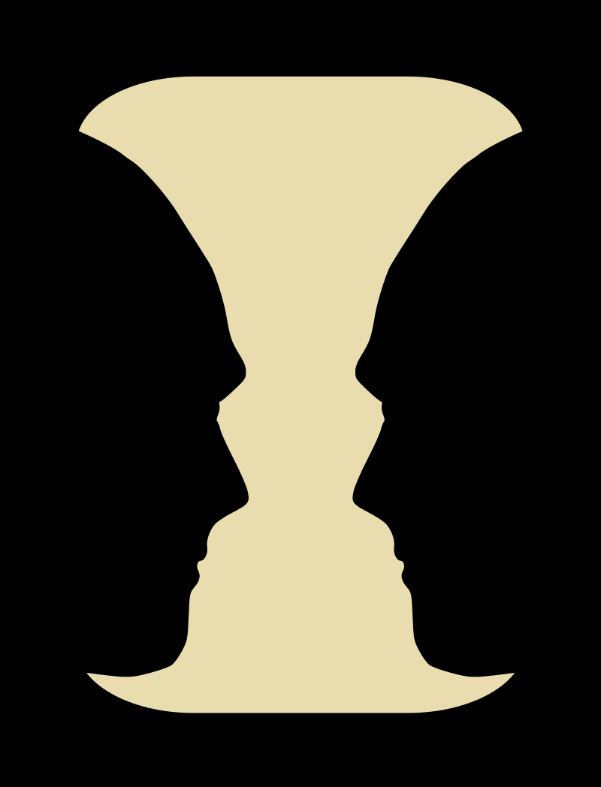
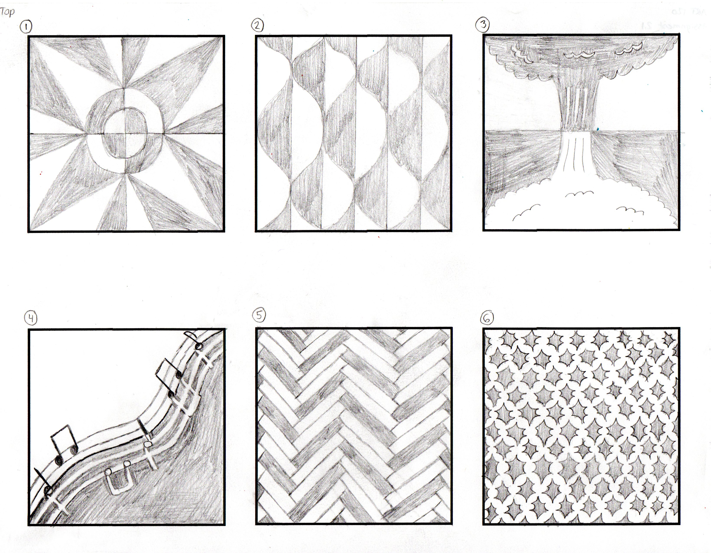
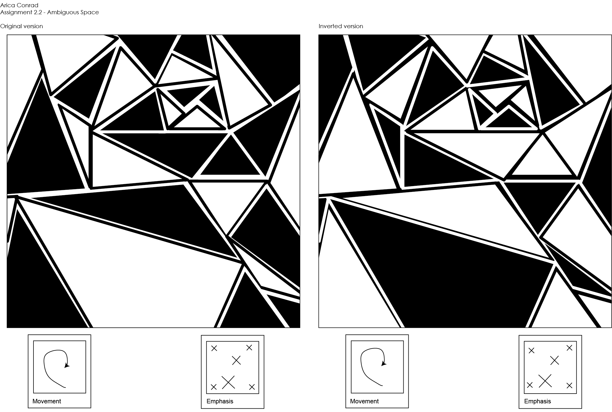

# Assignment 2 - Ambiguous Space ☯️

# About This Assignment

For this assignment in my graphic design class, we were going to explore positive, negative, and ambiguous space in Adobe Illustrator using only black and white as the color scheme. 

Positive space in a design is what the viewer naturally focuses on. For instance, the person depicted in a portrait is the positive space. In contrast, negative space is the space around the positive space and is often a place of rest for the eyes. Using the previous example of a person depicted in a portrait, the background is the negative space. When done well, a combination of positive and negative space can lead to a pleasing and balanced viewing experience.

For this assignment, though, we were going to focus on ambiguous space. Ambiguous space is when the amount of positive and negative space in a design is nearly or completely equal. This can cause a design to "flip-flop" easily for the viewer. Optical illusions often use ambiguous space to trick the viewer into seeing two different designs, such as in the famous optical illusion, Rubin's vase, as shown here: 

_Is it a white vase, or two black silhouettes?_

# Rough Drafts

To start this assignment, I first created 12 rough drafts using pencil and paper. I struggled a bit with this step, as trying to create designs that have a nearly equal amount of positive and negative space was hard. A few of my designs were inspired by curtain patterns in houses I saw while on a walk through my neighborhood to gather ideas.

# Process

After our rough drafts were finished, we were instructed to choose one of the designs to focus on for creating our final submission using Adobe Illustrator. Our final design did not have to match our rough draft exactly; it was only a guide for us. 

Out of all of my designs, I gravitated the most to my final design, #12. I created this design after seeing images of the Yin Yang symbol and Te Fiti's heart in the Disney movie "Moana." I thought it had some interesting circular movement and an equal balance of positive and negative space. 

My professor concurred that this would be a good design to focus on, but she challenged me to break my symmetry. As shown in my rough drafts, I like images with perfect symmetry. That is what is pleasing to my eye. My professor thought that if I could create an image with asymmetry, I would have a more dynamic design and I would be challenging myself as an artist. While difficult, this challenge ended up being worthwhile. 

# Final Submission

This was my final submission for Assignment 2. I also attached this picture in a post to a Canvas discussion forum for peer analysis by my classmates.

This was my submission statement:

The design I made for this assignment was based on drawing #12 from my original sketches. Going through the entire design process meant that my final design became only loosely based on my original sketch. My design is made entirely of triangles, and while you may think that meant I used the triangle shape tool (part of the star tool), I did not. The issue I found with the triangle shape tool was that it only made equilateral triangles, which was not what I wanted. As a result, most, if not all, of my triangles were made using the pen tool, so I gained a lot of experience using that specific tool. I found my greatest weakness during the design process was how much I had to fight the urge to make everything symmetrical or perfectly aligned. Purposefully making my design off-center and making the triangles not be the same shape or size took me out of my comfort zone and challenged my rule-abiding mindset. 
