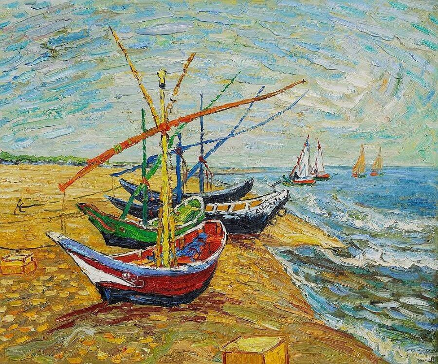
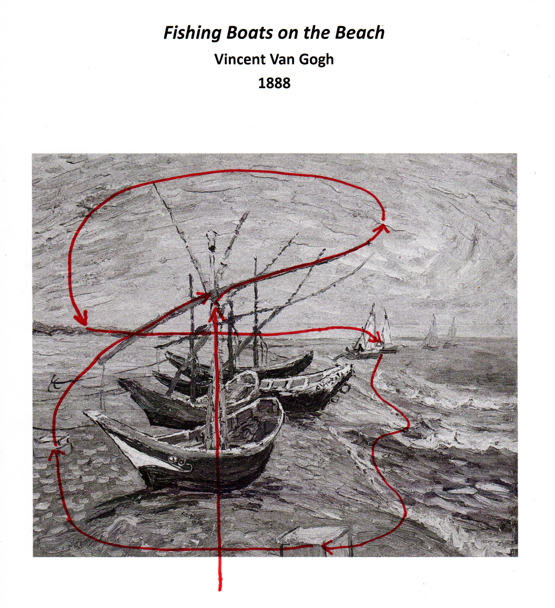
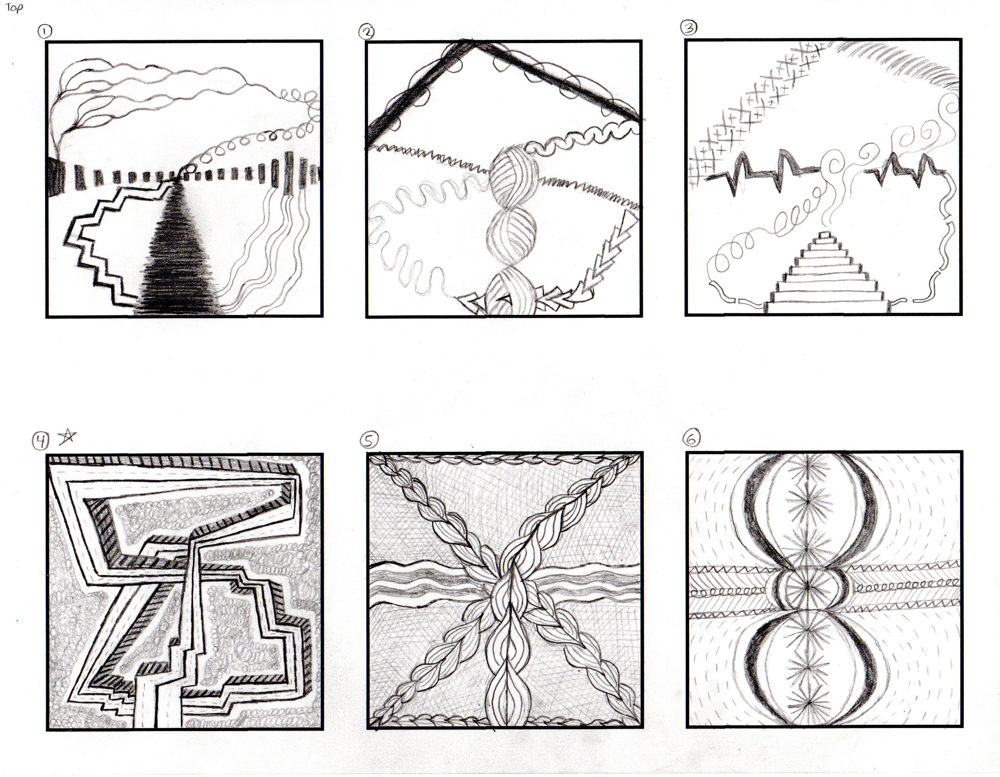
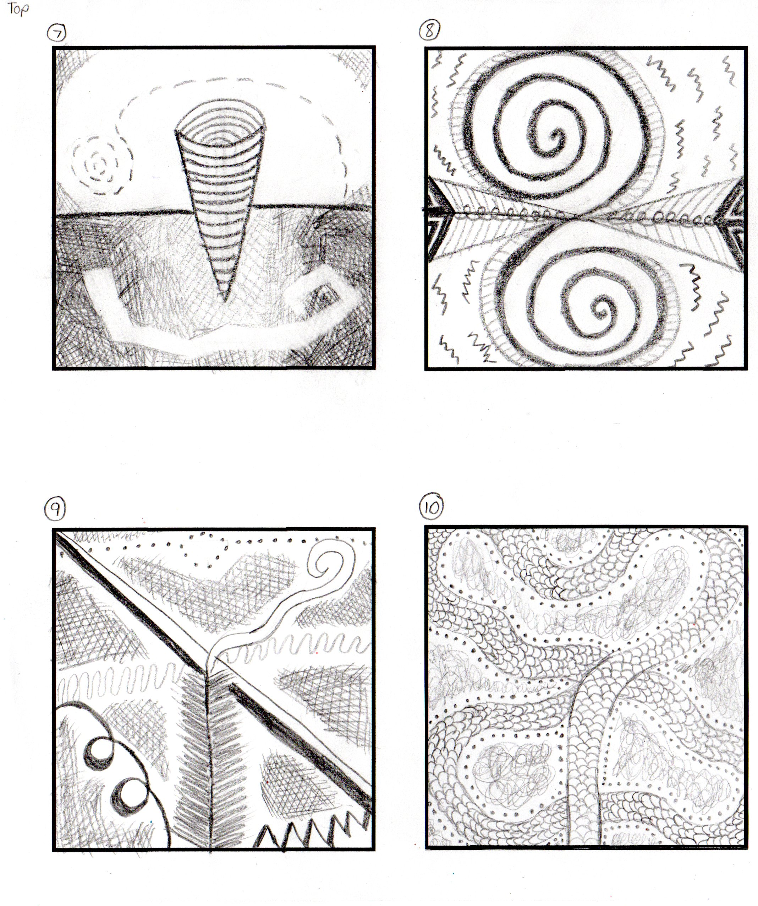
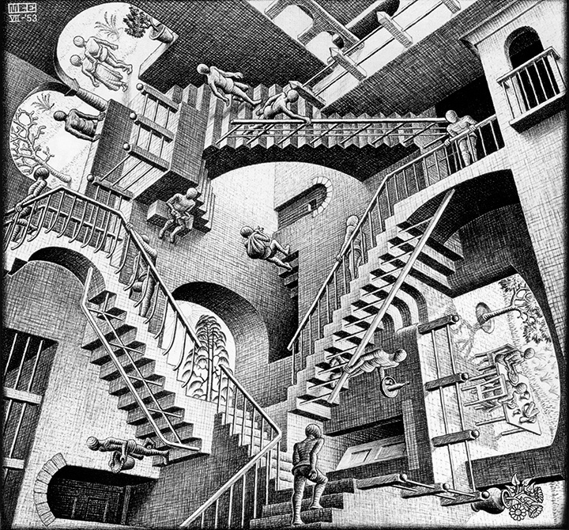
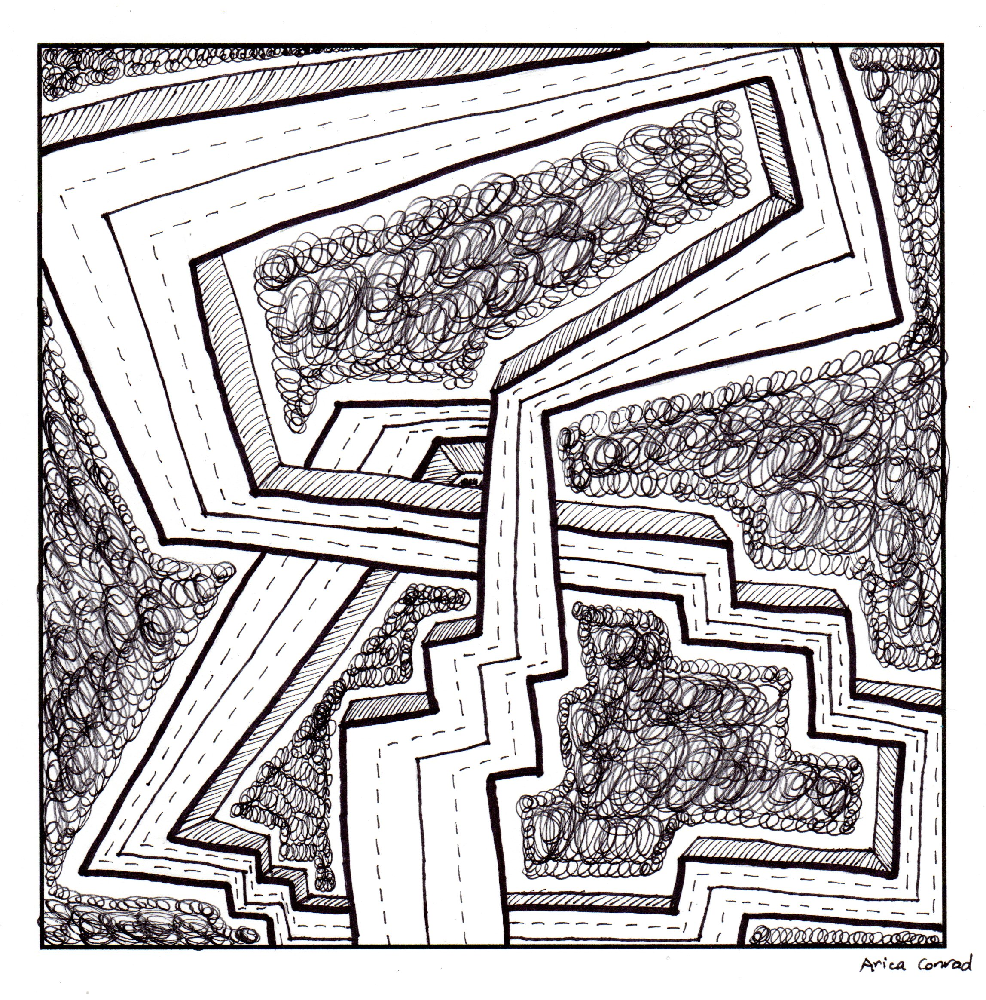
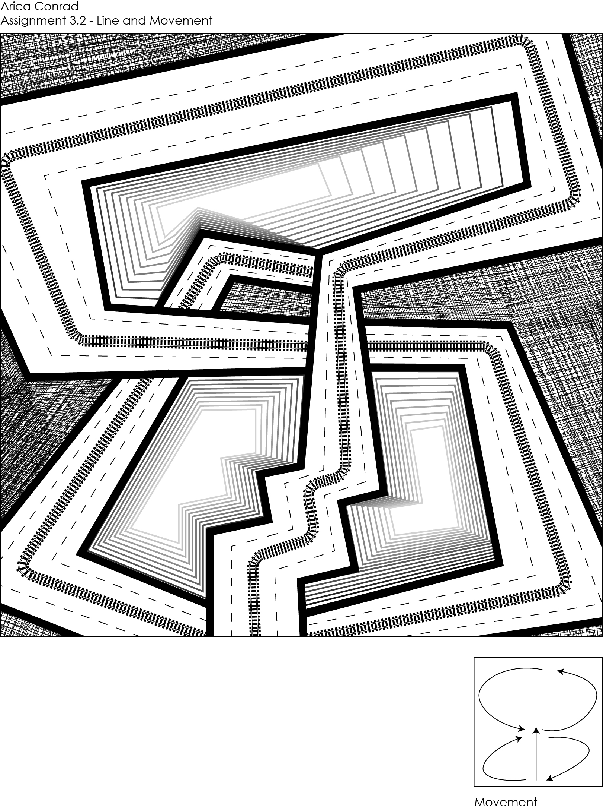

# Assignment 3 - Line and Movement 🔄

# About This Assignment

For the third assignment in my graphic design class, we were going to be focusing on line and movement. Specifically, our final design in Adobe Illustrator would be one continuous line following a movement pattern inspired by a classic work of art.

# Inspiration

To start this assignment, we first had to pick a piece of art with some strong movement that was created by a famous painter (my professor provided us with a list of example artists to choose from). I chose Vincent Van Gogh as my artist, as his painting, _The Starry Night_, is my favorite work of art. The painting I ended up focusing on for this assignment was Van Gogh's 1888 painting, _Fishing Boats on the Beach_, as shown here:

I liked how this picture was distinctively Van Gogh to me, with his signature paintbrush strokes, especially in the sky.

Next, my professor instructed us to print out the art we chose. Color was not going to be used in this assignment, so my picture was printed in black and white. Then, she told us to use a marker to draw how our eyes moved around the picture when we looked at the different areas of emphasis. This one continuous line showed the overall movement of the piece and would be the starting point for our rough drafts.

# Rough Drafts

Using the continuous line created in the previous section, we then created 10 pencil and paper rough draft drawings. Our drawings could use any shape or line type, as long as they had the same general movement as our inspiration.

At first, I had some trouble creating designs based on my line movement. My first few drawings rigidly stuck to the original line movement, but my choices of shapes and lines ended up looking a bit chaotic and incongruent with each other. Towards the end of my rough drafts, I started thinking more of the overall picture by creating abstract drawings in a figure-eight shape, which was close to my original movement line. 

From this point on, I decided to focus on my fourth drawing (the one with a star next to the number 4). I liked the use of different line thicknesses to create one continuous movement, and I thought these types of lines (thin, thick, dashed, solid, etc.) would be easier to implement in Adobe Illustrator compared to some of the lines and shapes in my other designs. My drawing was partially inspired by the stair drawings created by M.C. Escher, such as this one: 

# Tight Rough Draft

Before creating our design in Adobe Illustrator, we first created a tight rough version of our chosen design using Sharpie. We were also able to make the picture bigger to focus more on the details.

Some feedback my professor gave me about my rough draft was to not be afraid to let my design extend past the edges of the frame. I took that advice with my tight rough draft and modified the overall shape of the movement by tilting it so it could extend past the corners. One of my other major changes was to simplify the 3-D aspect of my shape. Instead of alternating with dark and light sections, I went with one thin line type.

# Final Submission

This was my final submission for Assignment 3. I also attached this picture in a post to a Canvas discussion forum for peer analysis by my classmates.

This was my submission statement:

I found that translating my Sharpie drawing to Illustrator was more challenging than I had anticipated. Some of the design choices I made with pen and paper did not look as good in Illustrator, so I had to make some new design choices, which involved a lot of trial and error. For instance, I had filled in the negative space of my Sharpie drawing with curly lines, but I did not like how it looked in Illustrator. Instead, I decided to use cross-hatching, and I followed a tutorial online to make it (the tutorial link is at the end of my reflection).

I slightly redesigned the overall "shape" (which is not a shape but just numerous lines on a white background), as the original version's "shape" was too tight to fit my two dashed lines and my middle line in Illustrator. I was pleasantly surprised by how well my middle line looked when I gave it a railroad track stroke. It provided a rougher, zipper-like feel to my design. 

Throughout this assignment, I gained knowledge in using the blend tool for my cross-hatching and for creating depth. To create depth, I made a black line that is the biggest shape of the opening, and then towards the middle, I made a light gray line that is a smaller version of the shape of the opening. I then used the blend tool, which created a nice illusion of something going infinitely down, largely due to the gradient I applied. Creating this depth meant that I received three more focal points – the sections where the white background completely shows through.

Link to cross-hatching tutorial: [http://nickcassway.com/designblog/?p=1633](http://nickcassway.com/designblog/?p=1633)

  ---

[Home Page](../README.md) | [Graphic Design Samples Page](./graphic-design-samples.md)
