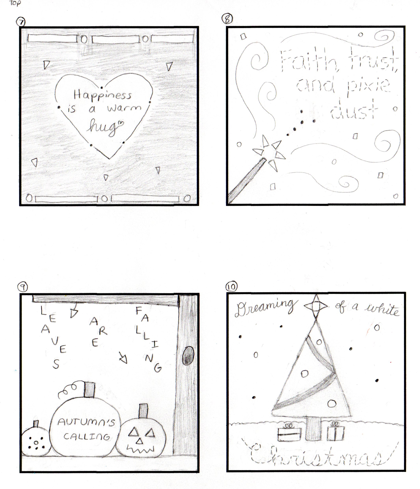
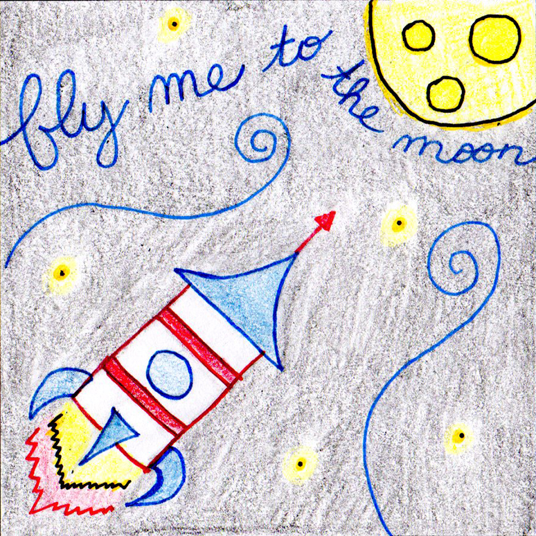
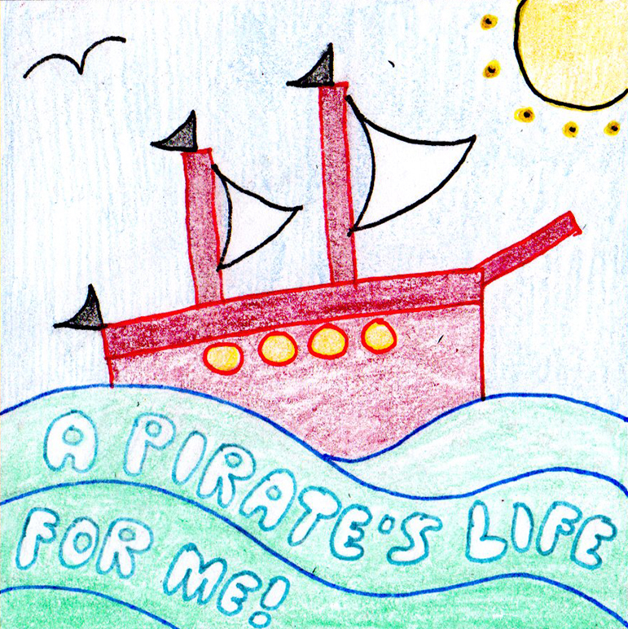
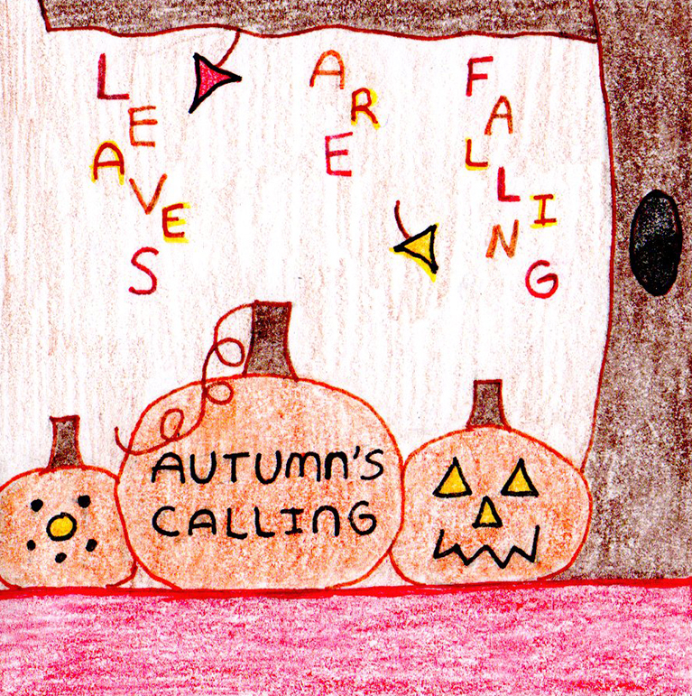
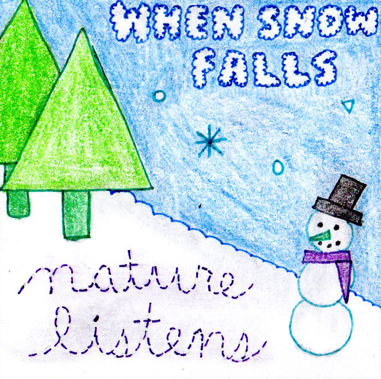
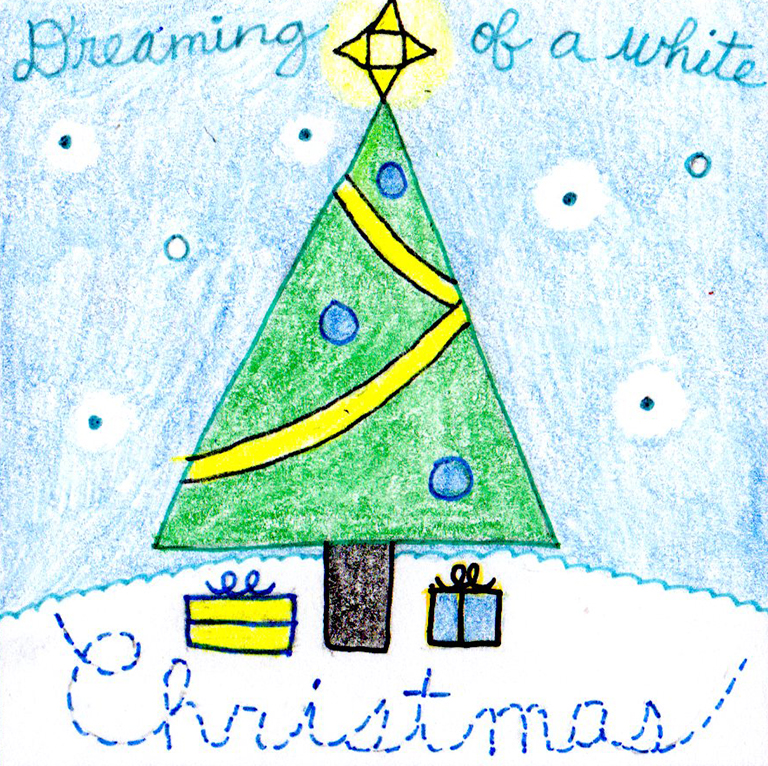
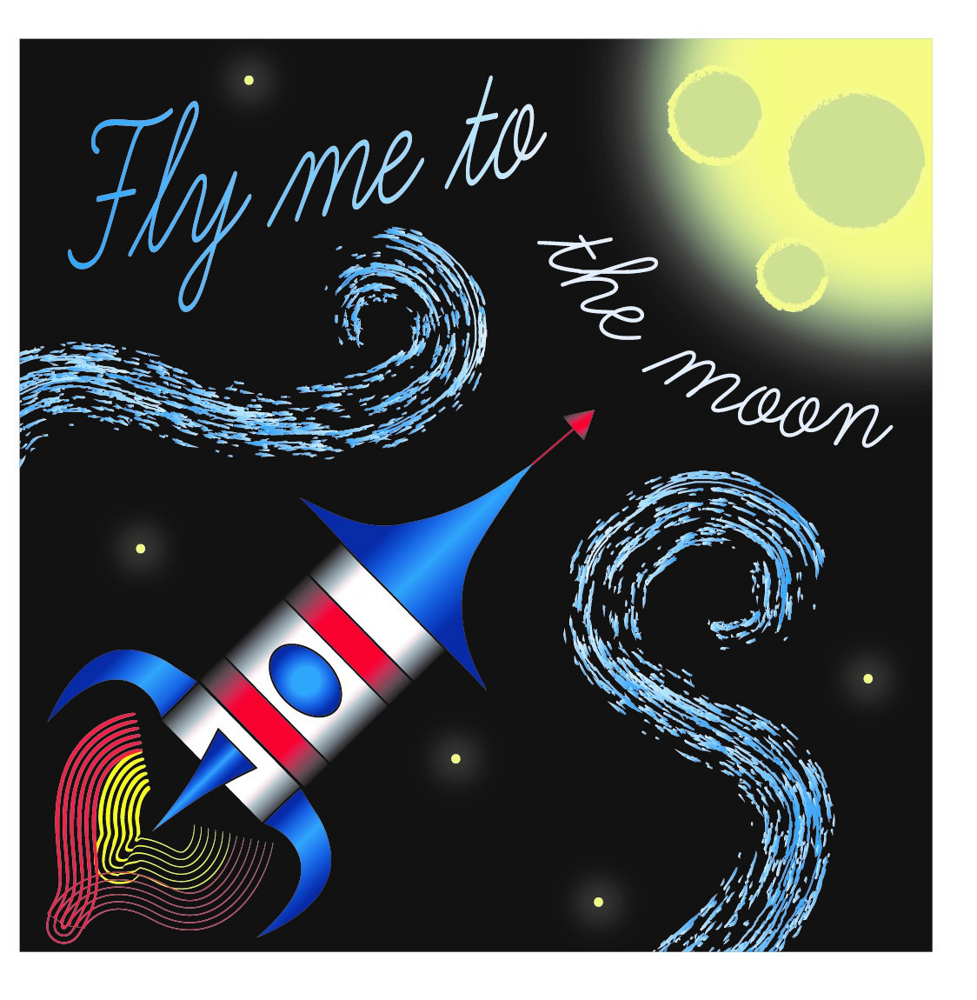

# Assignment 4 - Lines, Shapes, Words, Colors 🚀

# About This Assignment

For this assignment in my graphic design class, we were instructed to focus on lines, shapes, words, and colors to convey a message. Specifically, each picture had to include the following (no more, no less):

-	5 words (my professor was flexible and counted contractions as one word)
-	5 lines
-	5 dots
-	5 circles
-	5 triangles
-	5 squares/rectangles
-	Either an analogous or triadic color scheme (black and white were also okay to include)

My professor also stressed the importance of creativity and exploring typography for each picture. She wanted each picture to be unique.

# Rough Drafts

I first created 10 rough draft drawings using pencil and paper. I had fun experimenting with the typography for each picture, especially the bubble font I used for my "A pirate’s life for me!" picture. Most of the phrases I used in my drawings came from pop culture, either through songs or movies. The drawing I ended up choosing for my final design was inspired by Frank Sinatra’s "Fly Me to the Moon" song.

# Tight Rough Drafts

After my rough draft drawings were complete, I chose five of them to explore further. For these tight rough drafts, we could introduce color in the form of analogous or triadic color schemes (black and white could also be included). I picked color schemes that seemed most realistic for each picture. For instance, autumn has a lot of reds and oranges in real life, so I thought an analogous color scheme using red, orange, and yellow would be the most realistic. In contrast, I imagined my rocket ship using a retro red, white, and blue color scheme, so adding yellow to color the Moon would make a triadic color scheme.

# Process

I decided to create my final submission based on my first tight rough draft, the rocket ship picture. I have always been fascinated with space, and implementing a triadic color scheme with a black background was intriguing to me. If I had not picked this design to implement, my second choice was the pirate ship picture.

I first recreated my picture in Adobe Illustrator. I did end up having to do some research on the Internet to achieve some effects I was imagining in my mind, which I discussed in my final submission. 

I also played around with the idea of applying strokes that create lots of lines. I discussed this with my professor, and we decided that I should use strokes that do not make a lot of lines to fit with the spirit of the shape limitations (e.g. five lines only). However, I still want to share this other version of my design, as it helped influence my final design. Just to reaffirm, I only drew five lines in Illustrator; this is all stroke technique.

I then used Adobe InDesign to create my final submission layout. We were instructed to include our final draft image, our five tight rough drafts, and our submission statement.

# Final Submission

Here is a bigger version of my final picture:

This was my submission statement:

I decided to choose my first tight rough as the one that will be rendered in Illustrator. In my tight rough, I used a primary color triadic scheme, and I decided to stick with that, as I liked how it popped against the black background. I utilized Illustrator’s suggested tints and shades for the triadic colors I chose, and you can see that in the moon and the gradient in the text, swirls, and rocket ship. The font I used was an Adobe cursive font called “Learning Curve.” That provided the right “flying among the stars” feeling I was going after.

To achieve all of the effects I wanted for my design, I did have to do some internet research on applying a gradient to text and applying a gradient to a stroke. This research was worth it, though, because I was able to achieve the effect of the text increasing in lightness as it got closer to the Moon by using a lighter blue color. To achieve the effect of the Moon glowing, I used the Blur effect that was shown in one of the given resources. I also used the Blur effect on my stars and my swirls.

The part I am the proudest of, though, is the rocket ship. When I was putting the red and white rectangles together to make the body of the rocket ship, I found that it was too flat. In my mind, rocket ships are rounded tubes, but I was using rectangles. While experimenting with gradients, I discovered that if I used white or red and then applied a fade-to-black gradient (still sticking within my triadic scheme), the rectangles now looked like they were curving around, providing just the effect I wanted. I applied similar gradients to the rest of the rocket ship to make it look more 3D.

  ---

[Home Page](../README.md) | [Graphic Design Samples Page](./graphic-design-samples.md)
