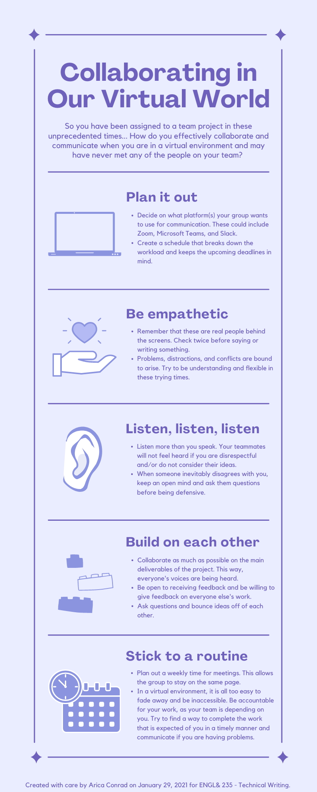

# Collaborating In Our Virtual World Infographic 🖼️

# About This Assignment

I took my Technical Writing class during the height of the COVID-19 pandemic. As a result, group work dynamics changed drastically. Instead of collaborating in person, all communications with team members were done remotely. Before we started working in groups in my Technical Writing class, my professor gave us this assignment to complete. She wanted us to create an infographic about how to work remotely as a team. She encouraged us to think about our values and potential problems we have faced before as inspiration for the main points our infographic would have. She hoped these infographics would help guide us as we transitioned into working in groups.

# Process

I first drafted what I wanted to say using Microsoft Word. I thought about what made group work enjoyable for me, and it was when everyone was empathetic, valued everyone’s ideas, and gave feedback to each other. I also thought about when I had problems in my past group projects, and it was often when people were unreachable and when work was completed late or not at all. I then created the text for my infographic by combining all of these ideas and using a professional and approachable tone.

Next, I used Canva to create my infographic. I liked the idea of using a monotone design, where the text and the background colors were in the same family. I chose purple since it was a unique and bright color. I also included icons so that my infographic had more visual interest.

# Final Submission

This was my final submission for this assignment. We also shared our infographics in a Canvas discussion forum for our peers to review.

If you would like to see the PDF version of this infographic, you can view it [here](../assets/files/Conrad-Collaborating-In-Our-Virtual-World-Infographic.pdf).

  ---

[Home Page](../README.md) | [Technical Writing Samples Page](./technical-writing-samples.md)
