# The iOS Calendar App Tutorial 📆

# About This Tutorial

**Complete later!!!**

Some background information about why I wrote this tutorial and what it means for TechEase.

Maybe talk about some challenges with writing this tutorial as well as how I gathered feedback.

Explain why I am providing an excerpt and not the whole tutorial. (Because it is very long...)

# Tutorial Excerpt

## Part 3: Adding a New Event

To add a new event, tap the "+" button in the top right corner.

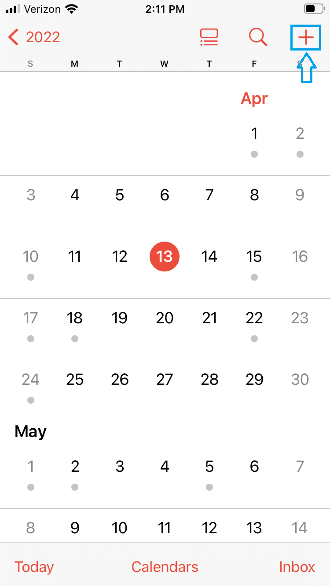

_Tap the "+" button in the top right corner to add a new event._

You should now see a screen that presents multiple fields you can add information to for your event. These fields include title, location, and more. To add to the fields, tap the field you want to edit. For instance, tap the "Title" field to add a title to your event. For the following example, the title added is "Book Sale" and the location is "Public Library."

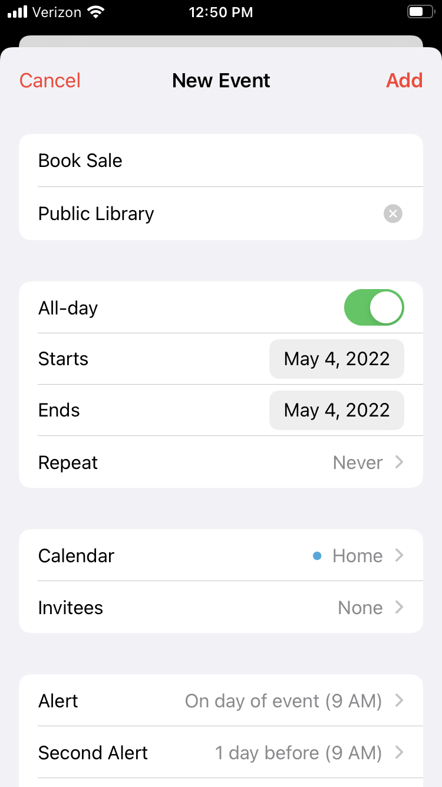

_This is the screen you see when you add a new event. The title is "Book Sale" and the location is "Public Library."_

An important field to note is the "All day" toggle. Tapping this toggle on to green means the event you are adding lasts all day, such as for a book sale or a birthday. If your event does not last all day, tap the toggle off to gray. 

When the toggle is turned on (green), the start and end date of the event defaults to the same day. Also note that the date of the event defaults to the current date, unless you tapped a specific day on the calendar before tapping the "+" button. To change the date, tap the date and select the desired date from the calendar picker. Tap the date again once you are finished to dismiss the calendar picker.

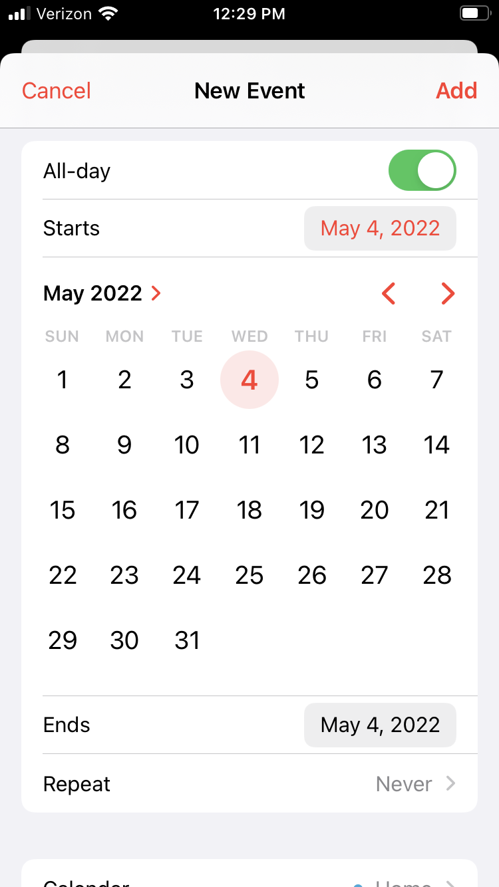

_If the all-day toggle is turned on (green), tap the date and a calendar picker will be displayed._

When the toggle is turned off (gray), you can provide the start and end time of the event in addition to the start and end date of the event. Tap the time to change it. Each part of the time (hour, minutes, and AM/PM) is a separate scrolling field. Swipe up or down on the numbers to select your event time. Tap the time again once you are finished to dismiss the time picker.

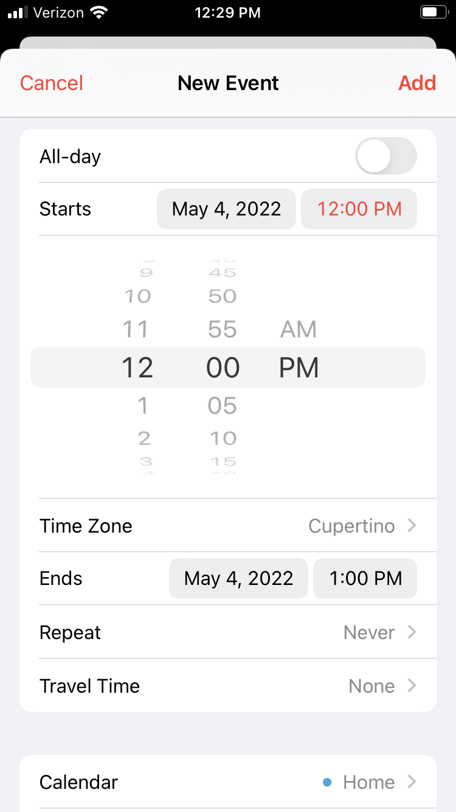

_If the all-day toggle is turned off (gray), tap the time and a time picker will be displayed._

Another important field is the repeat field. If the event you are adding repeats, such as for a birthday every year, you can customize the repeat field to list the event on the same day every year. You will then not have to recreate the event every time it occurs. Tap the repeat field to customize it.

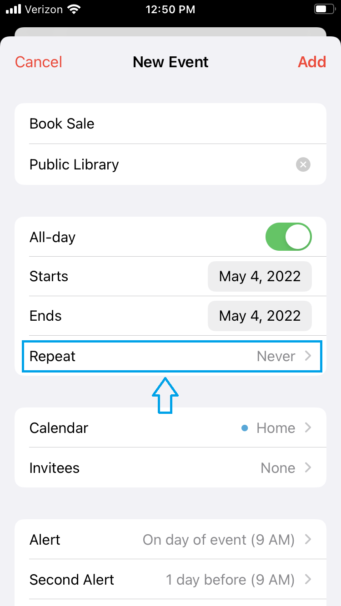

_Tap the "Repeat" field to specify events that repeat._

You will be presented with several options for the frequency of the repeated event. The repeat options are the same regardless of whether your event lasts all day or only for part of the day. Select the repeat option that best fits with your event. You can also customize the frequency of repetition by using the "Custom" option if the provided options are not suitable. In the following screenshot, the user selected the "Every Year" option. Selecting an option will return you to the event creation screen.

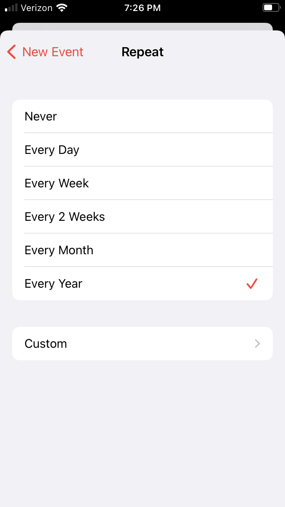

_The user selected the "Every Year" repeat option for their event._

You can also set an alert for the event in the alert section. Alerts will send a notification to your phone before the event occurs as a reminder for you. Tap the "Alert" option and select the desired alert time from the provided options.

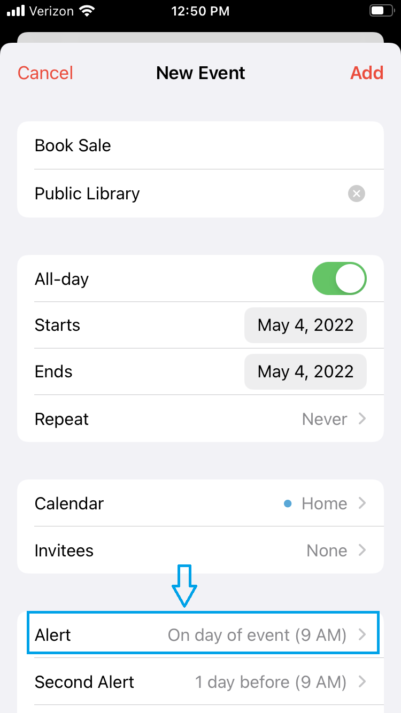

_Tap the "Alert" field to add an alert for your event._

Note that different alert options are available depending on whether your event lasts all day or only for part of the day. The following screenshot shows the options for an all-day event. Once you select your desired alert option, you will be returned to the event creation screen.

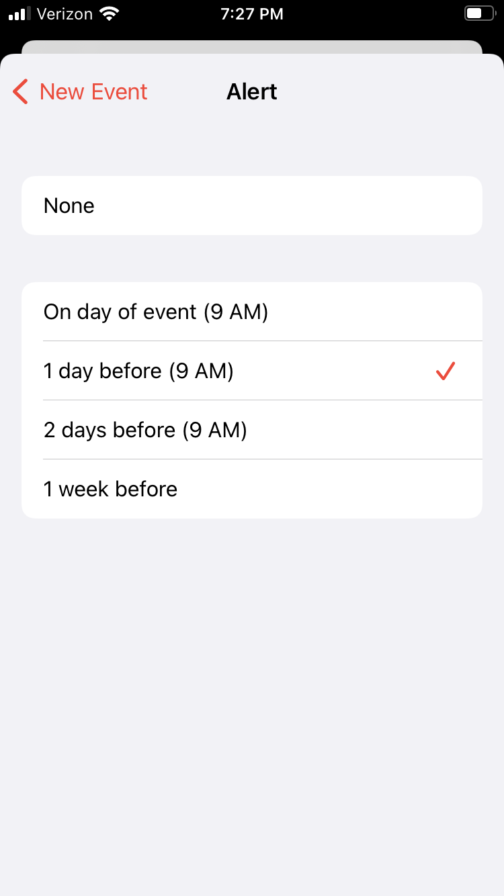

_The alert options for an all-day event. The user has selected "1 day before (9 AM)" as their desired alert._

You can also add a second alert, such as if you want an alert one day before and one hour before the event. Tap the "Second Alert" option and you will be given the same provided options as described previously.

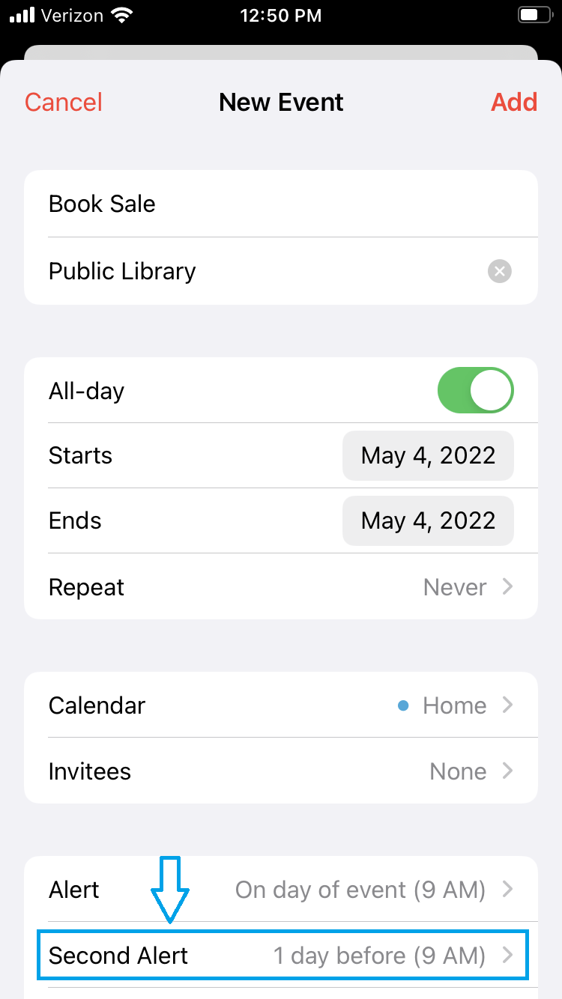

_Tap the "Second Alert" field to add a second alert for your event._

If you would like to discard all your event changes without saving them, tap the "Cancel" button in the top left corner. Otherwise, once you are satisfied with your event, tap the "Add" button in the top right corner to add the event to your calendar.

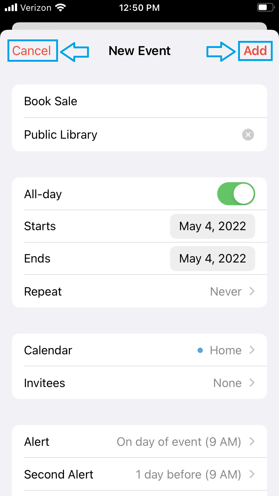

_Tap the "Cancel" button to discard your changes or tap the "Add" button to add your event._

You should now be able to see your event on the calendar, either as a dot in the monthly view or the name of the event in the daily list view.

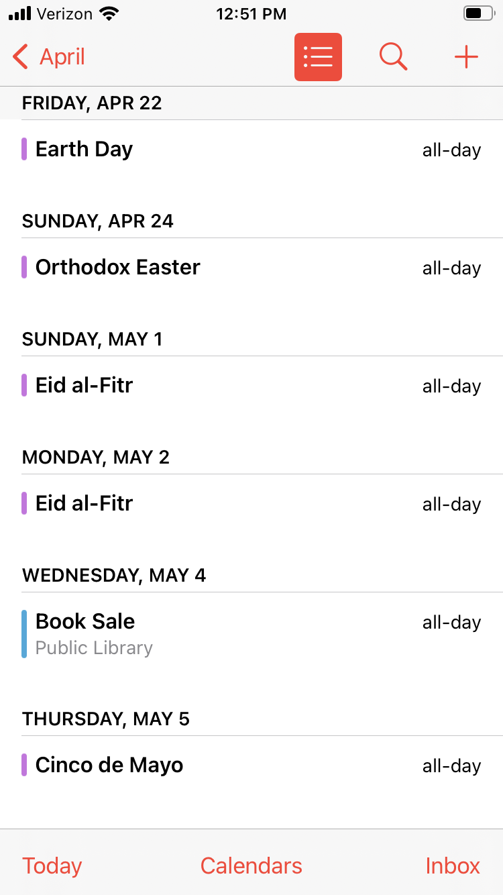

_The new "Book Sale" event on May 4 can be seen in the daily list view._

When an event has been added to your calendar, the event will appear as an alert notification on your phone's lock screen on the day of the event. To view the event, if you are logged out of your phone, swipe up on your lock screen and a small box will display your event in the Notification Center. If you are logged into your phone, swipe down from the top of the screen and the same Notification Center will be displayed. The following screenshot is an example of an alert notification for a holiday in the lock screen's Notification Center.

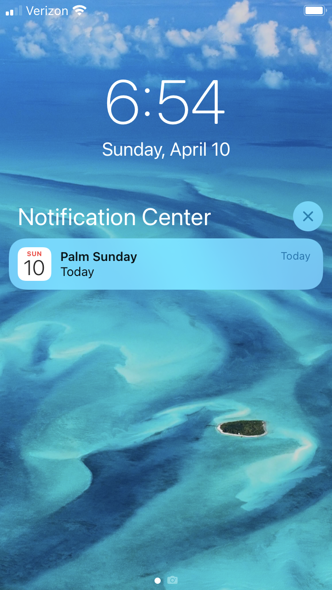

_An event alert in the lock screen's Notification Center about the holiday Palm Sunday._

# Want to Read More?

If you would like to read the full version of the iOS Calendar App Tutorial, you can view the PDF file of the tutorial [here](../assets/files/Conrad-iOS-Calendar-App-Tutorial.pdf).

  ---

[Home Page](../README.md) | [Technical Writing Samples Page](./technical-writing-samples.md)
