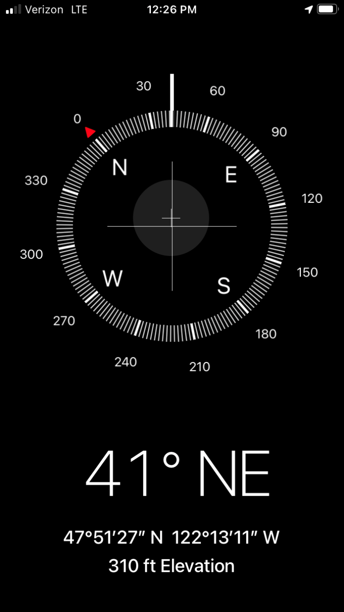
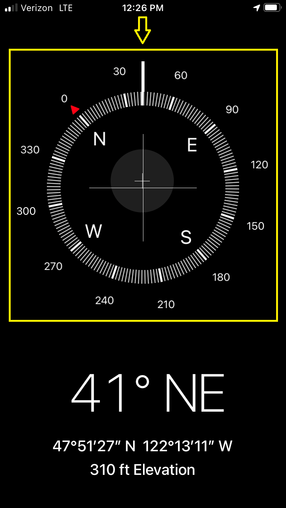
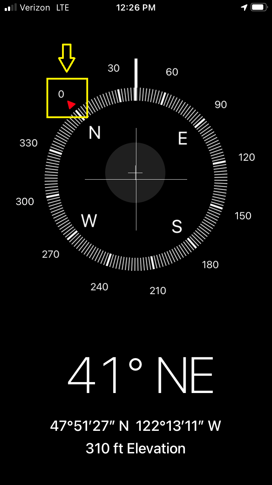
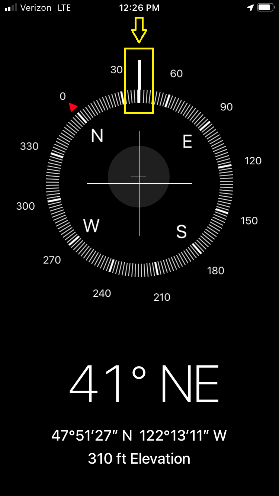
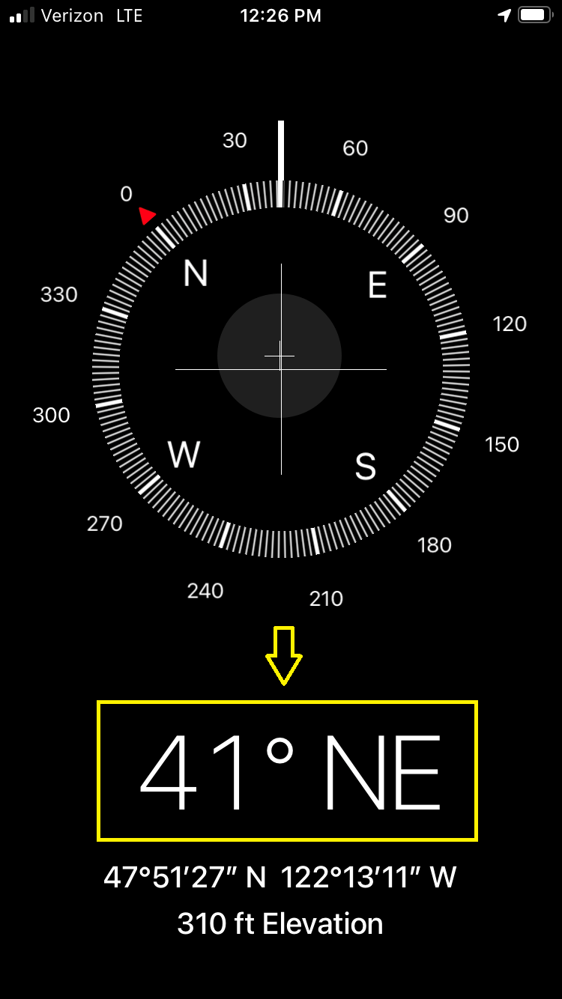
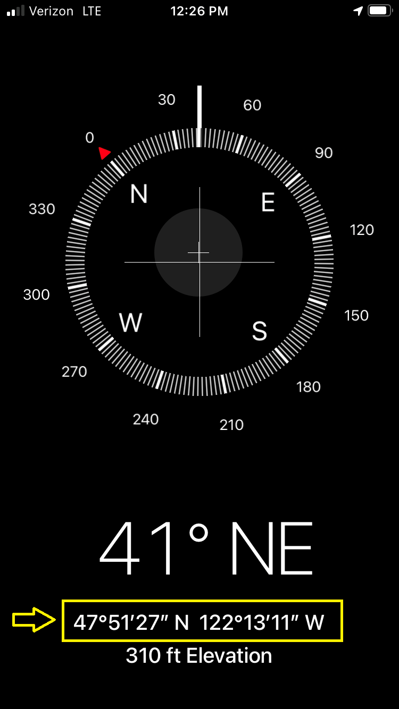
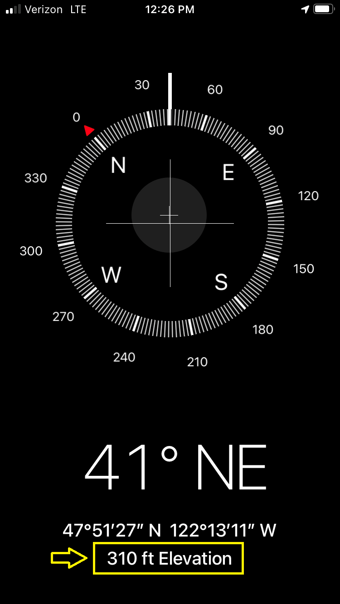
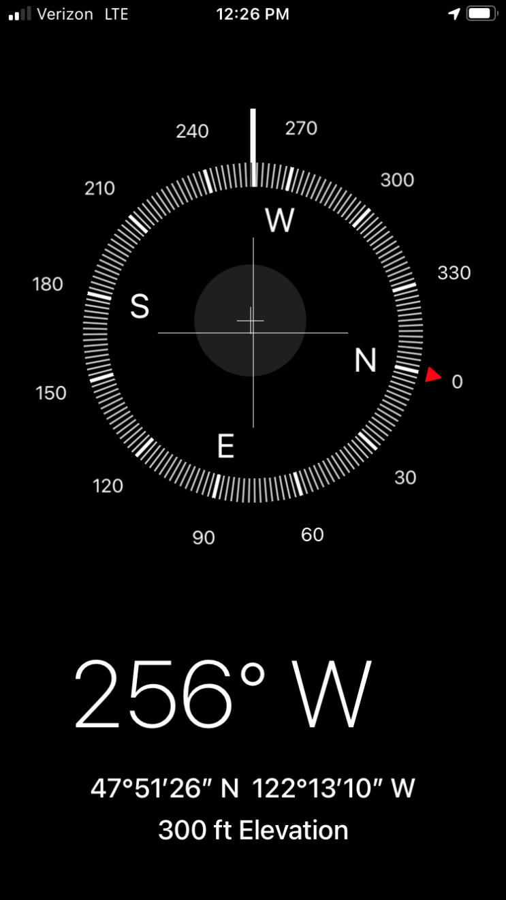
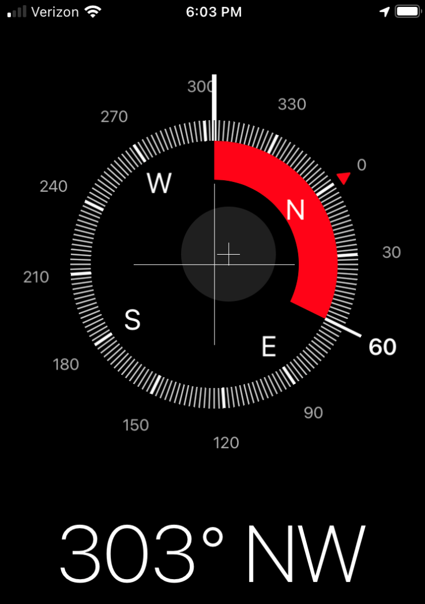

# The iOS Compass App Tutorial 🧭

# About This Tutorial

**Complete later!!!**

Some background information about why I wrote this tutorial and what it means for TechEase. Probably could mention that this was the first tutorial I wrote for TechEase.

Maybe talk about some challenges with writing this tutorial as well as how I gathered feedback.

Explain why I am providing an excerpt and not the whole tutorial. (Because it is very long...)

# Tutorial Excerpt

## Part 2: Using the Compass App

Once the Compass app is open, you should see a screen that resembles the face of a compass with some data about your current location below it.

_The Compass app's screen._

The top half of the screen shows the cardinal directions of north, east, south, and west in a 360-degree circle.

_The main compass showing the cardinal directions and their corresponding degrees._

Zero degrees north is depicted as a red triangle pointing to "0" (zero).

_Zero degrees north has a red triangle pointing to "0" (zero)._

The direction your phone is facing is shown as a thick white line extending from the circle of degrees.

_The thick white line denotes what direction you are currently facing._

The bottom half of the screen describes your geographical location. 

The direction your phone is facing and the degree value of that direction is listed first.

_The current direction your phone is facing._

Next are the latitude and longitude coordinates of your location. The city and state you are currently located in may also be displayed underneath these coordinates if your phone is able to identify that information.

_The geographic coordinates of your location. If the city and state can be identified, they would be listed underneath these coordinates._

Finally, the elevation of your current location is listed.

_Your current elevation is shown last._

To change the direction your phone is facing, first place your phone flat in the palm of your hand with the screen facing up. Next, while keeping the phone flat in your palm, slowly move your arm in a half-circle. Notice how the thick white line showing your phone’s current direction has moved around the circle of degrees. Also notice that the direction listed at the bottom half of the screen changed to reflect where the thick white line is now. Try and see if you can make the thick white line complete a 360-degree rotation.

_Rotating your phone rotates the compass and changes the direction your phone is facing._

While rotating your phone, you may notice your phone producing vibrations. Your phone produces vibrations after passing every 30 degrees and a more pronounced vibration is produced after passing zero degrees. This tactile sensation is a normal function when using the Compass app.

The Compass app allows you to lock your current direction. This is helpful if you are moving in a specific direction (such as 10 degrees North) and want to stay on track.

To lock your current direction, tap anywhere within the compass face. Now try moving your phone around to change the direction. Notice how a thick red band appears in the inner circle of the compass. This red band is to show you how far off you are from your locked direction. Your locked direction is the bolded degree number and your current direction is the thick white line. Your current direction is also shown beneath the compass face.

_The red band shows you how far off you are from your locked direction. 60 degrees is the locked direction and 303 degrees is the current direction._

To unlock your current direction, tap anywhere within the compass face and the red band will disappear.

# Want to Read More?

If you would like to read the full version of the iOS Compass App Tutorial, you can view the PDF file of the tutorial [here](../assets/files/Conrad-iOS-Compass-App-Tutorial.pdf).

  ---

[Home Page](../README.md) | [Technical Writing Samples Page](./technical-writing-samples.md)
