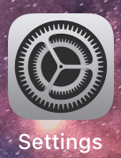
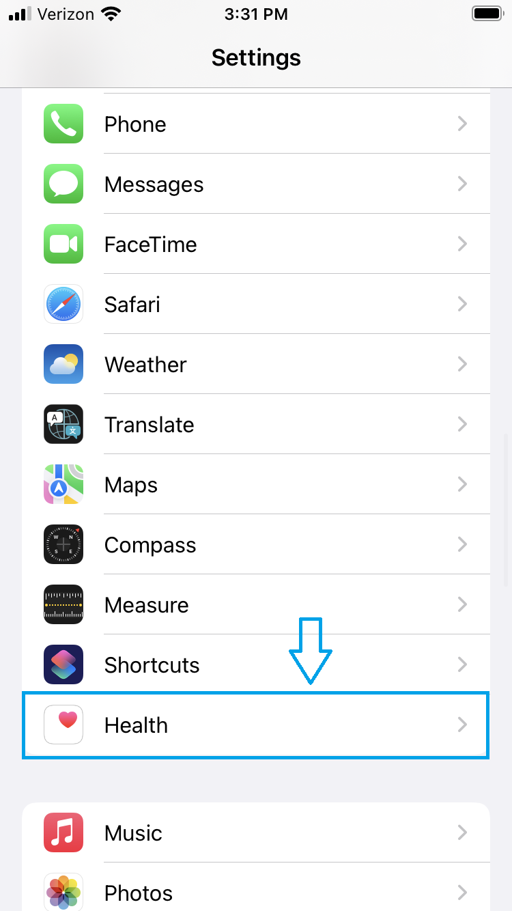
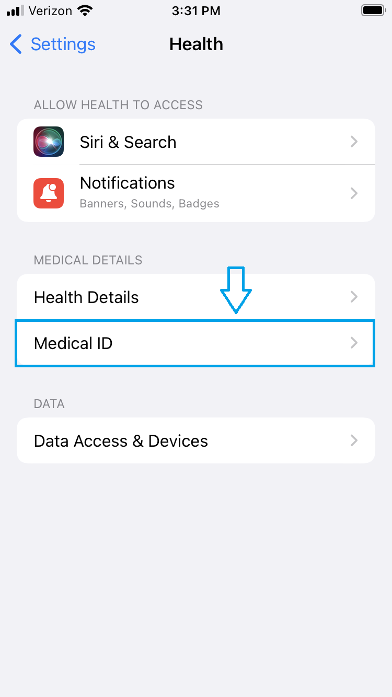
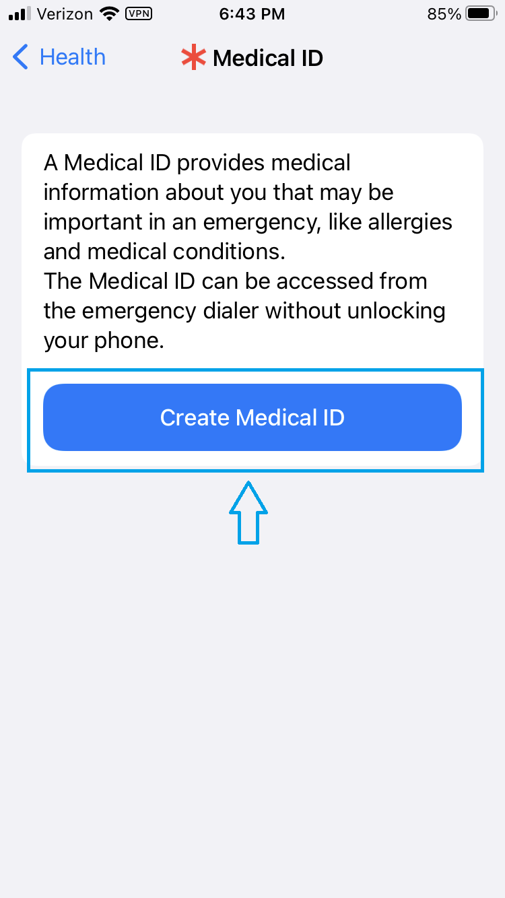
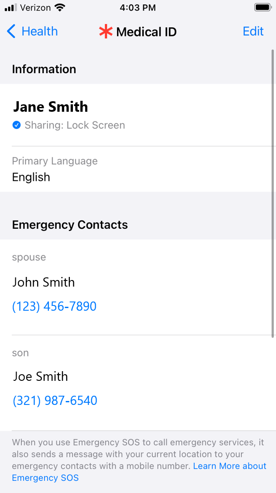
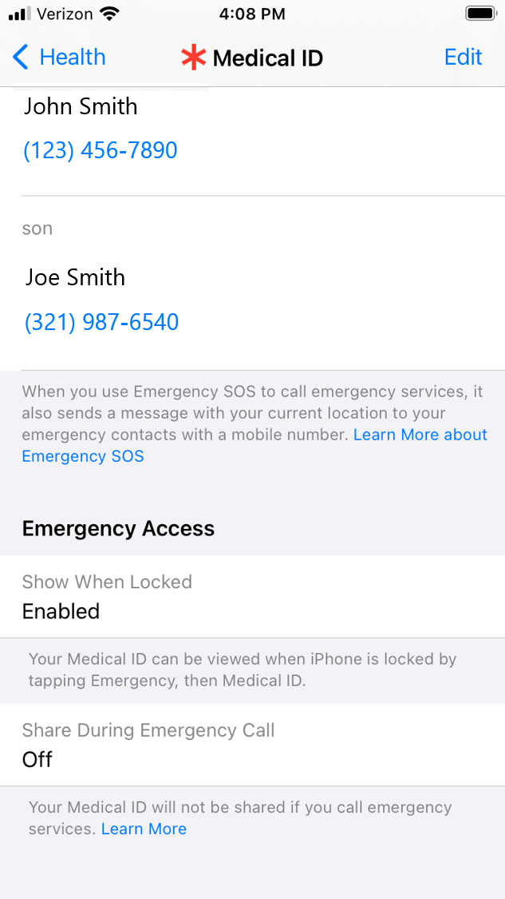

# The iOS Emergency Information Tutorial ⚕️

# About This Tutorial

The iOS Emergency Information App Tutorial was one of three tutorials I wrote for my capstone project (the other two being the [iOS Compass App Tutorial](./ios-compass-app-tutorial.md) and the [iOS Calendar App Tutorial](./ios-calendar-app-tutorial.md)). My capstone project focused on further developing TechEase, an app project I had been working on for most of my degree so that I could test the app with actual users. TechEase is an iOS app that provides text, video, and practice tutorials so inexperienced users can learn how to use their iPhones in a safe and controlled environment. TechEase was created for Wider Horizons, a Seattle-based organization for seniors. You can read more about the development of TechEase [here](https://github.com/MobileApps-Cascadia/TechEase_iOS/wiki).

This tutorial was the third and final tutorial I wrote for TechEase. The Emergency Information tutorial was specifically requested by Wider Horizons, as their organization had many people wanting peace of mind in the event they had a medical emergency and were unresponsive. I am only providing an excerpt of my tutorial in the next section, as the original tutorial is fairly long, but a link to the full tutorial PDF is listed at the end of this page.

# Tutorial Excerpt

## Part 2: Accessing the Medical ID From the Settings

Medical ID is not automatically set up on your phone, so you will have to set it up yourself.

To view your Medical ID, first locate and tap the Settings icon to open your phone's settings. The Settings icon looks like a gear and it has the name "Settings" below the icon.

_The Settings icon and name._

Once the Settings is open, scroll down until you see the "Health" option and then tap it. The "Heath" option has an icon of a white square with a pink heart in the corner.

_Scroll down on the Settings screen until you see the "Health" option and then tap it._

On the Health screen, tap the "Medical ID" option under the section called "Medical Details."

_On the Health screen, tap the "Medical ID" option under the section called "Medical Details."_

You should now be on the Medical ID screen. This is where you can input your personal information to any of the fields you want to.

If you already have the Medical ID setup and are returning to add or edit the information, you will see a screen that shows all of your information. However, if this is your first time setting up the Medical ID, you will be shown information about what the Medical ID is used for and the option to create your Medical ID. Tap the blue "Create Medical ID" button.

_Tap the blue "Create Medical ID" button to start creating your Medical ID._

Once the blue "Create Medical ID" button is tapped, you will be presented with a few screens to input your information and to confirm the creation of the Medical ID. For the purpose of this tutorial, we will just initialize the Medical ID without adding any extra information for now. Tap the "Next" button at the top right corner of the screen. You will then be given a preview of your information. Tap the "Done" button at the top right corner. (Should you want to go back, tap the "Cancel" or "Back" buttons in the top left corner.) Once you tap the "Done" button, the Medical ID screen will display all your information. Do note that there may be many empty fields for now.

Now that your Medical ID has been initialized, we can look at in more detail what each section means.

In the "Information" section, you can put your full name, your primary language, and any preferred medical information, such as blood type, medical conditions, and medications. In the following screenshot, the user opted to just include their name ("Jane Smith") and primary language ("English") when initializing the Medical ID.

The next section is the "Emergency Contacts" section, where you can add people from your Contacts List to be your preferred contacts in the case of an emergency. You can specify your relationship to each emergency contact as well. In the following screenshot, the user added in their spouse "John Smith" and their son "Joe Smith" as emergency contacts, with their phone numbers listed below their names, when initializing the Medical ID.

Note that you may not have this information listed in your Medical ID. The following section, "Part 3: Adding to and Editing the Medical ID's Information," will explain how to add this information to your Medical ID.

_The Medical ID screen. All the information you add will be displayed here. The user had added their full name, primary language, and two emergency contacts when initializing the Medical ID._

Finally, in the "Emergency Access" section, there are two important options that you can turn on or off.

The first option is to allow your Medical ID to be viewed when your phone is locked. This option must be turned on if you want emergency responders to be able to view your medical information without needing you to log in to your phone. Please note that anyone who views your Medical ID through the lock screen will not be able to edit your information. Only someone who is logged in to the phone, such as yourself, can change this information. 

The second option is to share your Medical ID if you call emergency services, such as 911. If you would rather not have your Medical ID shared when calling emergency services, you can turn this option off.

_The Medical ID screen continued. The "Emergency Access" section allows you to decide if you want your Medical ID visible on the lock screen and to be shared during an emergency call._

# Want to Read More?

If you would like to read the full version of the iOS Emergency Information Tutorial, you can view the PDF file of the tutorial [here](../assets/files/Conrad-iOS-Emergency-Information-Tutorial.pdf).

  ---

[Home Page](../README.md) | [Technical Writing Samples Page](./technical-writing-samples.md)
