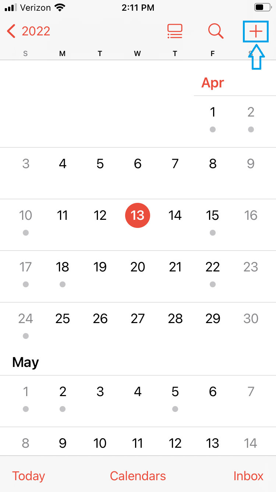

# The iOS Emergency Information Tutorial ⚕️

# About This Tutorial

**Complete later!!!**

Some background information about why I wrote this tutorial and what it means for TechEase.

Maybe talk about some challenges with writing this tutorial as well as how I gathered feedback.

Explain why I am providing an excerpt and not the whole tutorial. (Because it is very long...)

# Tutorial Excerpt

## Part 2: Accessing the Medical ID From the Settings

Replace this text.

_Replace this image._

# Want to Read More?

If you would like to read the full version of the iOS Emergency Information Tutorial, you can view the PDF file of the tutorial [here](../assets/files/Conrad-iOS-Calendar-App-Tutorial.pdf).
REPLACE THIS LINK!

  ---

[Home Page](../README.md) | [Technical Writing Samples Page](./technical-writing-samples.md)
